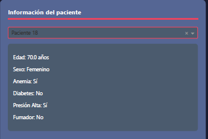
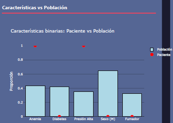
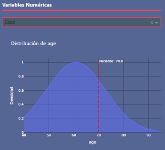
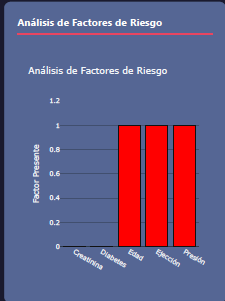
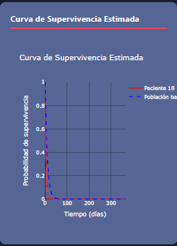
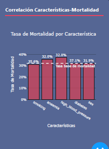

# Manual de Usuario - Dashboard de Valoración de Insuficiencia Cardíaca

## 1. Introducción al Dashboard
   - **Propósito**: Este dashboard tiene como objetivo evaluar el riesgo de insuficiencia cardíaca en pacientes, empleando un modelo de machine learning y análisis de supervivencia basado en datos clínicos. Su uso principal es brindar un análisis rápido y visual del estado del paciente en relación con una base de población general.
   - **Alcance**: El análisis está fundamentado en datos específicos del paciente, como edad, anemia, diabetes, presión arterial alta y tabaquismo, lo cual permite estimar la probabilidad de supervivencia y entender el impacto de estos factores en la salud del paciente.

## 2. Descripción de los Componentes del Dashboard

   ### Información del Paciente
   Esta sección muestra los datos clínicos del paciente. Los datos visibles incluyen:
   - **Edad**: La edad actual del paciente.
   - **Sexo**: Género del paciente (Femenino o Masculino).
   - **Anemia**: Indica si el paciente tiene o no anemia.
   - **Diabetes**: Muestra si el paciente padece diabetes.
   - **Presión Alta**: Indica si el paciente tiene presión alta.
   - **Fumador**: Muestra si el paciente es fumador o no.

   

   ### Características vs Población
   En esta sección, puedes comparar las características del paciente con las de una base poblacional. Incluye:
   - **Características Binarias**: Un gráfico de barras compara la proporción de características como anemia, diabetes, presión alta, sexo y hábito de fumar entre el paciente y la población general.
   - **Distribución de Carateristicas Númericas**: Un gráfico muestra la distribución en la población general, destacando la edad del paciente para facilitar la comparación.

   
   

   ### Análisis de Factores de Riesgo
   Este gráfico muestra la presencia de factores de riesgo en el paciente y permite observar su frecuencia en la población. Cada factor (como la creatinina, diabetes, presión arterial, etc.) se compara visualmente para ver su relación con la insuficiencia cardíaca y su relevancia en la población.

   

   ### Curva de Supervivencia Estimada
   La curva de supervivencia proyecta la probabilidad de supervivencia del paciente en el tiempo, comparando sus resultados con una curva de referencia poblacional. Esto ayuda a ver cómo los datos del paciente afectan su probabilidad de supervivencia a lo largo del tiempo.

   

   ### Correlación Características-Mortalidad
   Este gráfico presenta la tasa de mortalidad asociada con características específicas, tales como fumar o tener presión alta, comparándolas con la tasa base de mortalidad en la población. Ayuda a entender la influencia de cada característica en la mortalidad.

   

## 3. Interpretación de Resultados

   ### Probabilidad de Supervivencia
   - **Interpretación**: La curva de supervivencia muestra el porcentaje de probabilidad de que el paciente sobreviva a lo largo del tiempo. Una probabilidad más baja que la de la población general podría indicar un mayor riesgo debido a las condiciones clínicas del paciente.
   - **Comparación**: La línea del paciente en la curva puede compararse con la línea de referencia para ver si está por encima o por debajo de la expectativa de la población.

   ### Tasa de Mortalidad por Característica
   - **Interpretación**: La tasa de mortalidad por característica muestra cómo cada condición (como fumar o tener presión alta) impacta en la mortalidad. Esto permite ver el nivel de riesgo que tiene el paciente en relación con cada característica.
   - **Comparación**: La comparación entre el paciente y la tasa base ayuda a identificar los factores más influyentes en su riesgo de mortalidad.

## 4. Guía para Navegación y Uso del Dashboard

   ### Seleccionar Paciente
   - **Cambio de Paciente**: Puedes seleccionar entre diferentes pacientes o cargar datos de uno nuevo utilizando el menú de selección en la parte superior del dashboard.
   - **Entrada de Datos**: Los datos pueden ingresarse manualmente o importarse si están disponibles en un archivo compatible con el sistema.

   ### Personalización de Gráficos
   - **Cambio de Vista**: Puedes seleccionar diferentes tipos de gráficos para visualizar los datos, como cambiar entre histogramas y gráficos de barras en la sección de características.
   - **Filtrar Características**: Hay opciones de filtro para ver solo características específicas que pueden ser más relevantes para el análisis de cada paciente.

   ### Exportar Resultados
   - **Descarga de Datos**: Se pueden exportar datos específicos del paciente o gráficas completas en formato PDF o CSV para registros o revisiones posteriores.

## 5. Recomendaciones de Uso

   ### Consideraciones Clínicas
   Los resultados deben ser utilizados por personal médico especializado, ya que este análisis no sustituye un diagnóstico profesional. Los médicos pueden utilizar la información para guiar sus decisiones clínicas, pero deben realizar estudios complementarios para confirmar cualquier conclusión.

   ### Limitaciones del Modelo
   - **Base de Datos Limitada**: El modelo utiliza una base de datos específica para la población de referencia, por lo cual los resultados pueden variar según la procedencia o características de otros pacientes fuera de esta población.
   - **Factores no Incluidos**: Algunos factores de riesgo no incluidos en este análisis podrían influir en la supervivencia del paciente.

## 6. Preguntas Frecuentes (FAQ)

   - **¿Qué hacer si los datos del paciente no son precisos?**
     - Si notas que hay datos incorrectos o faltantes, puedes actualizar manualmente cada dato ingresando al menú de información del paciente y corrigiendo los valores directamente.

   - **¿Puedo usar este análisis para otros tipos de insuficiencia cardíaca?**
     - Este análisis está específicamente diseñado para insuficiencia cardíaca y puede no ser aplicable a otros tipos de enfermedades cardíacas o condiciones crónicas.

   - **¿Cómo se actualiza el modelo de predicción?**
     - El modelo de predicción se actualiza regularmente para incorporar nuevos datos y mejorar su precisión. Puedes consultar las actualizaciones en la sección de ayuda.

Para agregar una sección de instalación utilizando Docker al final del manual, aquí tienes el contenido completo actualizado:

---

## 7. Instalación del Dashboard utilizando Docker

Para facilitar la instalación y despliegue del dashboard, puedes utilizar Docker, que permite ejecutar la aplicación en un contenedor independiente del sistema operativo.

### Requisitos Previos

1. **Docker**: Asegúrate de tener Docker instalado en tu sistema. Si no lo tienes, puedes descargarlo e instalarlo desde [https://www.docker.com/get-started](https://www.docker.com/get-started).

### Paso a Paso para la Instalación

1. **Clona el repositorio o descarga los archivos necesarios**: Asegúrate de tener el archivo `dashboard.py` del código de la aplicación, junto con la carpeta `assets` (si existe) que contiene el archivo CSS para el estilo del dashboard, y el archivo `requirements.txt`.

2. **Construye la imagen de Docker**: En la terminal, navega hasta el directorio donde tienes los archivos y ejecuta el siguiente comando:

   ```bash
   docker build -t heart_failure_dashboard .
   ```

   Este comando construirá una imagen llamada `heart_failure_dashboard`.

3. **Ejecuta el contenedor**: Una vez creada la imagen, ejecuta el siguiente comando para iniciar el contenedor:

   ```bash
   docker run -p 8050:8050 heart_failure_dashboard
   ```

   Este comando ejecutará el dashboard y lo expondrá en el puerto `8050` de tu máquina local. Ahora podrás acceder al dashboard en `http://localhost:8050` en tu navegador.

### Actualización del Dashboard

Para realizar cambios en el dashboard:
1. Modifica el código en los archivos locales.
2. Reconstruye la imagen de Docker con el comando `docker build -t heart_failure_dashboard .`.
3. Detén el contenedor anterior y reinícialo con el comando `docker run -p 8050:8050 heart_failure_dashboard`.